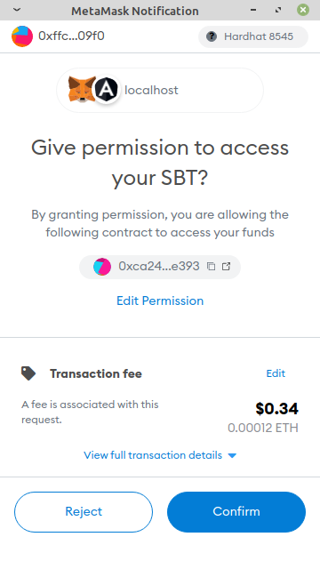

Ðapp Soccer Bet Workflow ⚽💰
===

This document describes how is a tipycal workflow using Ðapp Soccer Bet. 

# Connecting Metamask

The first step is connect your Metamask Wallet to the Ðapp Soccer Bet. This is done clicking at the button *Connect Wallet* at the top right.

# Buying Soccer Bet Tokens

As in a casino, to make your bets here you need to buy some amount of tokens, the Soccer Bet Token. In order to make this purchase, follow these steps:

1. Click on the icon    at the top left to show the menu and then click on the *Bet Token* item.
   
   

2. As you can see, on this screen you can check you Soccer Bet Token balance. To buy some Soccer Bet Tokens, click on *Buy Soccer Bet Tokens*.

1. Then a popup is presented so as you can input the amount of Soccer Bet Tokens you want to buy. The price of a token is 1 wei. Inform the value desired and click *Confirm*

4. After confirm the value, a Metamask popup will present the total costs of operation and ask for a confirmation. To confirm, click on blue button *Confirm* at the bottom right.

5. When the transaction is confirmed by the network, you will receive a notification and your balance will be updated.

# Bet on a Game

When you already have some Soccer Bet Token, you can go directly to this point.

1. Click on the icon    at the top left to show the menu and then click on the *Games* item.
   

2. As you can see, this screen is splited in 3 tabs accordingly to games statuses: *Open*, *Closed* and *Finalized*. The finalized games are finished, the final score is alreandy kwown and you can't bet anymore. The closed games you can't either, it can be just waiting for the final result of the game and will never be open again, or it's in the administrative process of registering and will be open for betting as soon as possible. The games on the *Open* tab are the games opened for betting, those are the ones you are looking for. So, chose the games you want to make your tosses.

3. Choosen a game you want to bet, you need to approve a amount of Soccer Bet Tokens to the contract of the Game. You are not betting with this approval, you are just approving in case you sometime decide to bet on this game. It's just a regular procedure for ERC-20 tokens. In practice, you could approve all your Soccer Bet Tokens for all games. Click on *Approve Bet Tokens* and inform the maximum amount of tokens you approve to this game. If you don't approve Bet Tokens for a game, you can't bet on it. In the same way, you can't bet an amount of tokens greater than the amount approved.

4. After clicking *Confirm*, you will see again a Metamask presenting the total costs of operation and ask for a confirmation. To confirm, click on blue button *Confirm* at the bottom right.

5. As soon as the transaction is confirmed by the network, you will see the ammount of tokens approved for the game on the right side of date and time info.

6. If you want, you can show or hide this info clicking on the button *Info* and choosing *Hide remaining Bet Tokens approved* or *Show remaining Bet Tokens approved*.

7. Finally you can make your toss on the game clicking on *Bet*. A popup will be shown so you can inform the amount of the approved Soccer Bet Tokens you want to bet and, of course, your final score guess.

8. After clicking *Confirm*, Metamask will present the total costs of operation and ask for a confirmation. To confirm, you know, click on blue button *Confirm* at the bottom right.

9. As soon as the network confirm the transaction of your bet, you're going be able to to it listed among all other bets on that game clicking on *Info* and then *Show bettings*. A popup will show all the bettings with it's respective data and the current prize* in Soccer Bet Tokens.

*The prize is 90% of the sum of all Soccer Bet Token amount put on game's bettings

10. After these steps, you just have to wait the game happen and the Ðapp Soccer Bet team input the final score.

# Catch the prize

1. After the game is finished and the score is inputed by Ðapp Soccer Bet, the game pass to be listed on the *Finalized* tab.

   
2. Clicking on *Info* button and *Show winners...*, you can see which bettings matched the game's final score and the prize. If your bet's score was reached, you're gonna see it listed on the popup with a *Withdraw* button.

3. Click on *Withdraw* to transfer the prize from the Game contract to your account and Metamask will ask for confirmation. To confirm, click on blue button *Confirm* at the bottom right.

   
4. After the transaction confirmation, your Soccer Bet Tokens balance will contain the value of your prize. You can see it returning to the Bet Token screen. You're able to use this balance for betting on other games or exchange part or all of it for the correspondent value in Ether. 

5. To exchange your Soccer Bet Tokens for Ether, click on *Exchange Soccer Bet Tokens* button and a popup asking the amount of Soccer Bet Tokens that you want to exchange will be shown. Inform the value and click on *Confirm*.

6. Finally, Metamask will show the transaction costs and ask for confirmation. To confirm, click on blue button *Confirm* at the bottom right.

